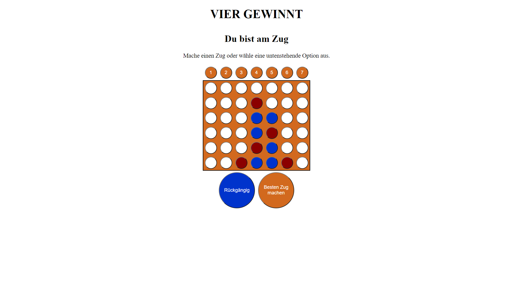

# Vier Gewinnt (PiS SoSe 2020)

Autor: Daniel Spengler, 5272969

Ich habe die Zulassung für PiS im SoSe 2020 bei Herrn Herzberg erhalten.

## Inhaltsverzeichnis

1. [Einleitung](#einleitung)
    1. [Spielregeln](#spielregeln)
    2. [Bedienungsanleitung](#bedienungsanleitung)
    3. [Dateiübersicht](#dateiübersicht)
2. [Spiel-Engine (ENG)](#spiel-engine-(eng))
    1. [Nutzung von Bitboards](#nutzung-von-bitboards)
    2. [Umsetzung von minimax](#umsetzung-von-minimax)
    3. [Monte-Carlo-Tree-Search](#monte-carlo-tree-search)
    4. [Auswertung des Spielendes](#auswertung-des-spielendes)
    5. [Konsolen- und GUI-Ausgabe](#konsolen--und-gui-ausgabe)
3. [Tests (TST)](#tests-(tst))
    1. [Die Tests werden wie folgt ausgeführt](#die-tests-werden-wie-folgt-ausgeführt:)
    2. [Die Testausgabe protokolliert sich über die Konsole wie folgt](#die-testausgabe-protokolliert-sich-über-die-konsole-wie-folgt:)
    3. [Hinweise zu den gewählten Testszenarios](#hinweise-zu-den-gewählten-testszenarios)
    4. [Bearbeiten und ändern der Tests](#bearbeiten-und-ändern-der-tests)
4. [Umsetzung der GUI](#umsetzung-der-gui)
5. [Hinweise](#hinweise)
6. [Quellennachweis](#quellennachweis)

## Einleitung

### Spielregeln

Bei "Vier gewinnt" handelt es sich um ein Strategie-Spiel für zwei Personen, 
welches mit einem aufrechtstehenden Spielbrett und Spielsteinen in zwei Farben gespielt wird.
Das Spielfeld besteht hierbei aus 7 Spalten (vertikal) und 6 Reihen (horizontal).
Beide Spieler werfen abwechselnd einen Spielstein ihrer Farbe von oben in eine Spalte ihrer Wahl, sodass dieser auf den untersten noch freien Platz
der jeweiligen Spalte fällt. Bei mehreren Zügen in die gleiche Spalte entstehen also "Stapel". Ist eine Spalte voll, so kann kein Zug mehr
für diese Spalte ausgeführt werden.

Ziel des Spiels ist es, vier Steine der eigenen Farbe in eine horizontale, vertikale oder diagonale Reihe zu bringen, um das Spiel zu gewinnen.
Gelingt dies keinem der beiden Spieler bis alle Spalten voll sind, so endet das Spiel mit einem Unentschieden.

### Bedienungsanleitung

Bei Start des Programms kann gewählt werden, ob man selbst das Spiel beginnen will oder ob der Computer
den ersten Zug machen soll. Außerdem gibt es hier ebenfalls die Möglichkeit den Testmodus zu starten, mit welchem 
Testszenarien (definiert durch die Bewertungskriterien) ausgeführt werden.

Wurde ein Spiel gestartet, wird das Spielfeld angezeigt. Darüber befinden sich die Buttons 1 - 7,
mit welchen der Spieler einen Zug ausführen kann. Unter dem Spielbrett befinden sich zwei Tasten: Eine zum Zurücknehmen
von Zügen und eine zum Ausführen des besten Zuges. All diese Buttons werden ausgeblendet, wenn der Computer für sich
den besten Zug sucht. Zusätzlich wird ganz oben auf der Seite angezeigt, wer gerade am Zug ist. 

Nach Abschluss eines Spiels wird angezeigt, wer das Spiel gewonnen hat. Außerdem stehen dem Spieler die gleichen Funktionen
wie bereits zu Spielbeginn (oben beschrieben) zur Verfügung.

### Dateiübersicht

    \build.gradle
    \README.md
    \Screenshot.png
    \src\main\resources\public\index.html
    \src\main\resources\public\main.js
    \src\main\kotlin\ConnectFour\App.kt
    \src\main\kotlin\ConnectFour\ConnectFour.kt
    \src\main\kotlin\ConnectFour\ConnectFourGame.kt
    \src\main\kotlin\ConnectFour\TST.kt

    -------------------------------------------------------------------------------
    Language                     files          blank        comment           code
    -------------------------------------------------------------------------------
    Kotlin                           4             42              7            374
    Markdown                         1            106              0            346
    HTML                             1             19              0            102
    JavaScript                       1             10              8             39
    Gradle                           1              8             14             16
    -------------------------------------------------------------------------------
    SUM:                             8            185             29            877
    -------------------------------------------------------------------------------

## Spiel-Engine (ENG)

Feature    | M   | H   | MC  | -   | B+I+Im | Summe
-----------|-----|-----|-----|-----|--------|----
Umsetzung  | 100 | 70 | 100 |   0 | 99.9    |
Gewichtung | 0.4 | 0.3 | 0.3 | 0.3 |  0.3   | 
Ergebnis   |  40 |  21 |  30 |   0 |   30   | **121%**

Die gesamte Spiel-Engine lässt sich in der Datei "ConnectFour.kt" finden. Das zugehörige Interface findet sich in "ConnectFourGame.kt".
Beide Dateien liegen im Verzeichnis src\main\kotlin\ConnectFour.

### Nutzung von Bitboards

Meine Umsetzung von "Vier gewinnt" benutzt Bitboards, um das Spielfeld zu
repräsentieren. Dabei besteht das Spielfeld aus insgesamt zwei Bitboards (eins für jeweils eine Partei), welche
in einem Pair gespeichert werden. Die Repräsntation und Funktionalität der Bitboards wurde dabei von 
[Herrn
Herzbergs Pseudocode und Erklärungen auf Github](https://github.com/denkspuren/BitboardC4/blob/master/BitboardDesign.md) entnommen
(letzter Zugriff: 30.07.2020).

In dieser Repräsentation beschreiben von rechts gesehen die ersten 7 Bit (0 - 6) die erste Spalte des Spielfelds, wobei das sechste
Bit nicht mehr zum Spielfeld selbst gehört, sondern später nur das Feststellen eines Gewinns ermöglicht. Auf die gleiche Weise geht es mit
den folgenden Spalten weiter. Dabei ist der Code allerdings nicht kopiert, da durch die immutable Programmierung viele Anpassungen
gemacht werden mussten. So musste beispielsweise Rekursion statt einer Schleife für "hasWon()" benutzt werden.

Die Funktionen makeMove() und undoMove() funktionieren im Grunde gleich wie der oben verlinkte Pseudocode, benutzen allerdings andere
Rückgabewerte und Datenstrukturen um immutabel zu bleiben. Für die Funktion hasWon() konnte keine einfache Schleife verwendet
werden, da dies eine mutable Datenstruktur erfordert hätte. Die Funktion hasWon() unterscheidet sich zum Pseudocode am wenigsten und kann
daher als Kopie angesehen werden.

### Umsetzung von minimax

Die Umsetzung von minimax, in Kombination mit Maps, zum Speichern von bereits bewerteten Spielstellungen habe ich auf Grundlage
von [Janek Bergs Nim-Code](https://pis2020.slack.com/archives/C011VKU81AR/p1593621224247400) (letzter Zugriff: 30.07.2020)
entwickelt. Dabei wurde minimax erweitert, um mit "Vier gewinnt" umgehen und mit einer festen Tiefe arbeiten zu können.

### Monte-Carlo-Tree-Search

Die Bewertungsfunktion meiner Umsetzung benutzt die Monte-Carlo-Tree-Search als Bewertungsmethode für Spielstellungen.
Dabei habe ich als Grundlage für die statistische Bewertung auf [Herrn Herzbergs Video zu Tic-Tac-Toe](https://www.youtube.com/watch?v=CjldSexfOuU) 
(letzter Zugriff: 30.07.2020) zurückgegriffen. Auch hier musste der Code stark angepasst werden, damit dieser sich in den immutablen Programmierstiel
einfügt. Durch diese Änderungen handelt es sich nicht um eine direkte Kopie.

Eine Besonderheit der Bewertungsfunktion ist, dass sie, wenn das Spiel schon endschieden sein sollte, MC nicht
mehr aufruft, sondern einen entsprechenden Wert zurückgibt. So kann in einigen Fällen Rechenzeit gespart werden.
Sollte das Spiel beim Erreichen der Bewertungsfunktion noch nicht entschieden sein, so wird das Spiel standardmäßig 75 Mal
durch Zufallszüge beendet. Desto häufiger dabei der maximierende Spieler gewonnen hat, desto
besser wird die Bewertung für diesen Spielzug ausfallen.

### Auswertung des Spielendes

Die Funktion isGameOver() stellt fest, ob das Spiel beendet ist, also ob ein Sieg oder ein Unentschiden vorliegt.
Die Funktion hasWon() wertet aus, ob einer der beiden Parteien gewonnen hat. Dabei wird nicht zurückgegeben, welcher Spieler 
gewonnen hat. Hierzu muss also eine Auswertung in Kombination mit dem aktuell ziehenden Spieler gemacht werden.

### Konsolen- und GUI-Ausgabe

Die restlichen Funktionen der Engine ermöglichen eine Ausgabe des Spielfelds auf der Konsole (toString() und toConsoleString())
und auf der GUI (toHTMLString(), generateGameTableRows() und getOwner()). Die Ausgabe auf der Konsole wird allerdings nur
für die Durchläufe der Tests benötigt. Die Umsetzung des Spielfelds für ein HTML-Dokument ist nicht zwingend für
jede Umsetzung von "Vier gewinnt" erforderlich, weshalb die Funktion auch nicht im Interface vorausgesetzt wird.

## Tests (TST)

Szenario |  1  |  2  |  3  |  4  |  5  | Summe
---------|-----|-----|-----|-----|-----|-------
ok       |  X  |  X  |  X  |  X  |  X  | 1.0

### Die Tests werden wie folgt ausgeführt:

In der GUI findet sich zu Spielbeginn und nach jeder Beendigung des Spiels eine Taste mit der Beschriftung "Tests starten".
Mit dem Auswählen diser Funktion werden die einzelnen Tests ausgeführt. Die GUI verweist nun auf die Konsole, um dem Testablauf
zu folgen. Auf der Konsole werden die Züge und die resultierenden Boards angezeigt. Sobald die Tests beendet sind, wird der Nutzer
darauf hingewiesen zurück zur Browseroberfläche zu wechseln. Hier können die Tests nun erneut gestartet werden oder ein
Spiel mit einem Computer begonnen werden.

### Die Testausgabe protokolliert sich über die Konsole wie folgt:

>Hinweis: X ist der Spieler, der das Spiel beginnt und O der nachziehende Spieler. Außerdem werden die Spiele nicht nach einem Zug beendet, sondern es werden 
so viele Züge ausgeführt, wie die gegebene Sichttiefe. In Szenario 2 werden also 3 Züge ausgeführt. Für den Testausgang ist allerdings schon der erste Zug,
welcher mit makeBestMove() gemacht wird entscheidend. Die restlichen Züge dienen im Prinzip als Nachweis, dass die AI tatsächlich gewonnen hat, bzw.
den Siegeszug der anderen Partei vereitelt hat. Dadurch das hier die Spiele mit mehreren Zügen gespielt werden, kann der Test einige Sekunden für
die Ausführung brauchen.

    Starte Testszenarios...
    Generiere Spielfeld fuer Test #1...
    Generiertes Board:
    |   |   |   |   |   |   |   |
    |   |   |   |   |   |   |   |
    |   |   |   |   |   |   |   |
    | O |   |   | X |   |   |   |
    | O |   |   | X |   |   |   |
    | O |   |   | X |   |   |   |

    Spieler 1 spielt in Spalte 3
    Spielfeld nach Ablauf des Tests:
    |   |   |   |   |   |   |   |
    |   |   |   |   |   |   |   |
    |   |   |   | X |   |   |   |
    | O |   |   | X |   |   |   |
    | O |   |   | X |   |   |   |
    | O |   |   | X |   |   |   |

    Spieler 1 hat gewonnen.
    Test erfolgreich.

    Generiere Spielfeld fuer Test #2
    GeneriertesBoard:
    |   |   |   |   |   |   |   |
    |   |   |   |   |   |   |   |
    |   |   |   |   |   |   |   |
    |   |   |   |   |   |   |   |
    | O |   |   |   |   |   |   |
    | O |   |   | X | X |   |   |

    Spieler 1 spielt in Spalte 5.
    Board nach Zug 1:
    |   |   |   |   |   |   |   |
    |   |   |   |   |   |   |   |
    |   |   |   |   |   |   |   |
    |   |   |   |   |   |   |   |
    | O |   |   |   |   |   |   |
    | O |   |   | X | X | X |   |

    Spieler -1 spielt in Spalte 6.
    Board nach Zug 2:
    |   |   |   |   |   |   |   |
    |   |   |   |   |   |   |   |
    |   |   |   |   |   |   |   |
    |   |   |   |   |   |   |   |
    | O |   |   |   |   |   |   |
    | O |   |   | X | X | X | O |

    Spieler 1 spielt in Spalte 2.
    Board nach Zug 3:
    |   |   |   |   |   |   |   |
    |   |   |   |   |   |   |   |
    |   |   |   |   |   |   |   |
    |   |   |   |   |   |   |   |
    | O |   |   |   |   |   |   |
    | O |   | X | X | X | X | O |

    Spieler 1 hat gewonnen.
    Test erfolgreich.

    Generiere Spielfeld fuer Test #3...
    Generiertes Board:
    |   |   |   |   |   |   |   |
    |   |   |   |   |   |   |   |
    |   |   |   |   |   | X |   |
    |   |   |   |   |   | O |   |
    |   |   | O |   |   | X | X |
    |   | O | X | X |   | O | O |

    Spieler 1 spielt in Spalte 3.
    Board nach Zug 1:
    |   |   |   |   |   |   |   |
    |   |   |   |   |   |   |   |
    |   |   |   |   |   | X |   |
    |   |   |   |   |   | O |   |
    |   |   | O | X |   | X | X |
    |   | O | X | X |   | O | O |

    Spieler -1 spielt in Spalte 6.
    Board nach Zug 2:
    |   |   |   |   |   |   |   |
    |   |   |   |   |   |   |   |
    |   |   |   |   |   | X |   |
    |   |   |   |   |   | O | O |
    |   |   | O | X |   | X | X |
    |   | O | X | X |   | O | O |

    Spieler 1 spielt in Spalte 4.
    Board nach Zug 3:
    |   |   |   |   |   |   |   |
    |   |   |   |   |   |   |   |
    |   |   |   |   |   | X |   |
    |   |   |   |   |   | O | O |
    |   |   | O | X |   | X | X |
    |   | O | X | X | X | O | O |

    Spieler -1 spielt in Spalte 4.
    Board nach Zug 4:
    |   |   |   |   |   |   |   |
    |   |   |   |   |   |   |   |
    |   |   |   |   |   | X |   |
    |   |   |   |   |   | O | O |
    |   |   | O | X | O | X | X |
    |   | O | X | X | X | O | O |

    Spieler 1 spielt in Spalte 4.
    Board nach Zug 5:
    |   |   |   |   |   |   |   |
    |   |   |   |   |   |   |   |
    |   |   |   |   |   | X |   |
    |   |   |   |   | X | O | O |
    |   |   | O | X | O | X | X |
    |   | O | X | X | X | O | O |

    Spieler 1 hat gewonnen.
    Test erfolgreich.

    Generiere Spielfeld fuer Test #4...
    Generiertes Board:
    |   |   |   |   |   |   |   |
    |   |   |   |   |   |   |   |
    |   |   |   |   |   |   |   |
    |   |   |   | X |   |   |   |
    | O |   |   | X |   |   |   |
    | O |   |   | X |   |   |   |

    Spieler 1 spielt in Spalte 3.
    Board nach Zug 1:
    |   |   |   |   |   |   |   |
    |   |   |   |   |   |   |   |
    |   |   |   | O |   |   |   |
    |   |   |   | X |   |   |   |
    | O |   |   | X |   |   |   |
    | O |   |   | X |   |   |   |

    Spieler -1 spielt in Spalte 5.
    Board nach Zug 2:
    |   |   |   |   |   |   |   |
    |   |   |   |   |   |   |   |
    |   |   |   | O |   |   |   |
    |   |   |   | X |   |   |   |
    | O |   |   | X |   |   |   |
    | O |   |   | X |   | X |   |

    Siegeszug von Spieler -1 wurde blockiert.
    Test erfolgreich.

    Generiere Spielfeld fuer Test #5
    Generiertes Board:
    |   |   |   |   |   |   |   |
    |   |   |   |   |   |   |   |
    |   |   |   |   |   |   |   |
    |   |   |   |   |   |   |   |
    |   |   |   |   |   |   |   |
    | O |   |   | X | X |   |   |

    Spieler 1 spielt in Spalte 5.
    Board nach Zug 1:
    |   |   |   |   |   |   |   |
    |   |   |   |   |   |   |   |
    |   |   |   |   |   |   |   |
    |   |   |   |   |   |   |   |
    |   |   |   |   |   |   |   |
    | O |   |   | X | X | O |   |

    Spieler -1 spielt in Spalte 3.
    Board nach Zug 2:
    |   |   |   |   |   |   |   |
    |   |   |   |   |   |   |   |
    |   |   |   |   |   |   |   |
    |   |   |   |   |   |   |   |
    |   |   |   | X |   |   |   |
    | O |   |   | X | X | O |   |

    Spieler 1 spielt in Spalte 3.
    Board nach Zug 3:
    |   |   |   |   |   |   |   |
    |   |   |   |   |   |   |   |
    |   |   |   |   |   |   |   |
    |   |   |   | O |   |   |   |
    |   |   |   | X |   |   |   |
    | O |   |   | X | X | O |   |

    Spieler -1 spielt in Spalte 3.
    Board nach Zug 4:
    |   |   |   |   |   |   |   |
    |   |   |   |   |   |   |   |
    |   |   |   | X |   |   |   |
    |   |   |   | O |   |   |   |
    |   |   |   | X |   |   |   |
    | O |   |   | X | X | O |   |

    Siegeszug von -1 blockiert.
    Test erfolgreich.

    Alle Tests beendet.
    Kehre nun auf die Browseroberflaeche zurueck.
    Die Ausfuehrung der Tests hat 24s gedauert.

### Hinweise zu den gewählten Testszenarios

Das generierte Spielfeld für Test 3 basiert auf der Grundlage eines Artikels von [Wikibooks](https://de.wikibooks.org/wiki/Vier_gewinnt:_Allgemeine_Taktiken_und_Tipps) (letzter Zugriff 30.07.2020),
welcher verschiedene Taktiken für das Spiel beschreibt.

Das Szenario in Test 5 kann von Spieler -1 theoretisch anders gespielt werden, da er noch rechts oder links
(je nach dem, wie Spieler 1 im ersten Zug reagiert) von
seinen beiden Steinen anlegen könnte um eine zweite Bedrohung aufzubauen. Dies tut der Algorithmus jedoch nicht,
da durch die Sichttiefe 4 bereits erkannt wird, dass der - in diesem Fall verteidigende - Spieler diese Chance
vereiteln würde. Allerdings hätte die Ausgangssituation, ohne die Reaktion im ersten Zug, für Spieler -1 in Zug 4 zu einem
Sieg führen können.

### Bearbeiten und ändern der Tests

Die Tests können in der Datei TST.kt angepasst und bearbeitet werden, welche im Verzeichnis src\main\kotlin\ConnectFour
gespeichert ist. Hier werden die Tests nacheinander in der Funktion runTests() aufgerufen. Wenn bestimmte Tests ausgelassen werden sollen,
können diese auskommentiert werden. Die einzelnen Testfälle sind in den Funktionen testX() (X = Nummer des Tests) bearbeitet werden.
Falls das Ergebnis des Tests gleichbleiben soll, aber eine andere Ausgangsstellung benutzt werden soll, genügt es jeweils die Zeile

    connectFour = connectFour.makeMove(...). ...

mit anderen Zügen zu editieren. Soll hingegen ein gänzlich anderes Szenario entstehen, so muss eventuell der beginnende Spieler 
angepasst werden und die for-Schleife auf die neue Anzahl der Züge modifiziert werden. Außerdem ist eventuell eine Anpassung
der Bedingung zum bestehen der Tests notwendig.

## Umsetzung der GUI

Die GUI besteht grundsätzlich aus den Dateien index.html, main.js und App.kt. Die Datei App.kt kann im gleichen Ordner
wie die Spiel-Engine gefunden werden. Die anderen Dateien sind im Verzeichnis src\main\resources\public zu finden.

Die Datei App.kt empfängt http-Requests, welche unterschiedliche Aktionen auslösen. Bei jedem Request wird am Ende der Ausführung
eine response in Form eines aktualisierten Spiels zurückgegeben. Möchte der Spieler Züge zurücknehmen, so werden immer zwei Züge zurückgesetzt,
damit der Spieler seinen vorherigen Zug ändern kann. Würde nur ein Zug zurückgesetzt werden, wäre der Computer direkt wieder an der Reihe
und für den Spieler würde mit hoher Wahrscheinlichkeit die gleiche Situation wie zuvor entstehen.

Die Datei index.html enthält das Styling der verschiedenen Elemente im Spiel und das Layout beim Start des Spiels. Das Spielfeld selbst wird 
durch eine Tabelle mit Buttons repräsentiert. Die Buttons sind dabei verschiedenfarbig, je nach dem welcher Partei die entsprechende Zelle
gehört. Der zu aktualisierende Bereich des Spiels liegt im div mit der id "game". Dieser Bereich wird mit einer http-response vollständig
aktualisiert.

In der Datei main.js werden die http-Requests versendet und die Antworten werden im HTML-Dokument wiedergespiegelt. Um Redundanzen im Code zu 
vermeiden, gibt es eine eigene Funktion für das Erstellen einer Request, welche nach einer Antwort eine Callback-Funktion aufruft.
Den Tipp Redundanzen zu vermeiden und mehrere Antworten für einen Request zu erhalten, wurde mir auf [Slack](https://pis2020.slack.com/archives/C012JM9QXTK/p1595075383432200?thread_ts=1594990115.426900&cid=C012JM9QXTK)
(letzter Zugriff: 30.07.2020) gegeben.
Im verlinkten Thread wurde auf einen [Artikel von w3Schools](https://www.w3schools.com/js/js_ajax_http_response.asp) (letzter Zugriff: 30.07.2020) verwiesen,
welcher Beispiele zur Verfügung stellt.

## Hinweise

In der Orginalversion von "Vier gewinnt" werden rote und gelbe Spielsteine benutzt. Da mir, bedingt durch meine starke Sehbehinderung, die Unterscheidung
von Gelb und der Hintergrundfarbe (Weiß) sehr schwer fällt, habe ich die gelben Spielsteine in meiner Umsetzung durch blaue ersetzt.

Bei der Anzeige der benötigten Zeit für einen besten Zug kann es vorkommen, dass eine Zeit von "etwa 0s" angezeigt wird. Jenes kann passieren,
wenn der entsprechende Zug unter einer Sekunde gefunden wurde. Hier rundet Kotlin ab, da ich die Zeitgenauigkeit nur in Sekunden, statt Millisekunden
angegeben habe.

In der Datei App.kt kann die Tiefe für ein Spiel global geändert werden, indem der Wert der Variable depth angepasst wird. Dieser ist
zu Beginn der Klasse zu finden.

Die Links zu den Quellen wurden an den entsprechenden Stellen im Code ebenfalls durch ein Kommentar erwähnt. Ich habe 
mich dagegen entschieden diese Kommentare zu entfernen, da so eventuell leichter nachvollziehbar ist, für welche Teile des Codes ich Quellen
benötigt habe.

## Quellennachweis

* [If-Abfragen als Expression für direkte Variablenzuweisung](https://stackoverflow.com/questions/16336500/kotlin-ternary-conditional-operator) (letzter Zugriff: 30.07.2020).
* Unterhaltung mit Gerlach, Marius: Hinweis auf den Artikel von Wikibooks um Szenario für Testszenario 3 zu finden (private Unterhaltung).
* Unterhaltung mit Berg, Janek: Mögliche Darstellung der Keys für die bei minimax verwendete Map um bewertete Spielstellungen zu speichern (private Unterhaltung).
